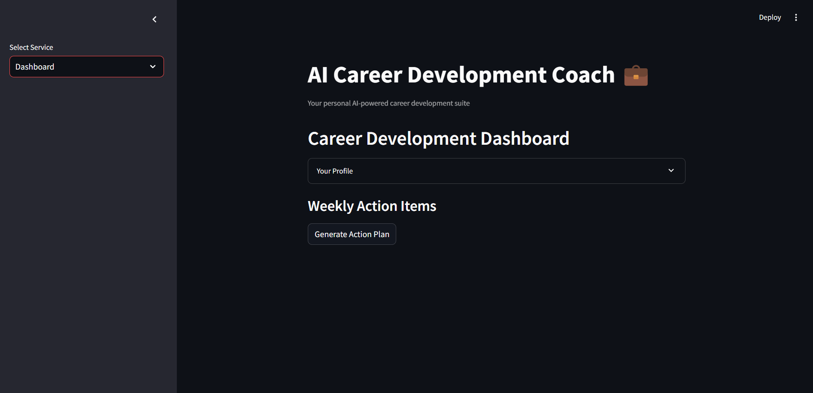
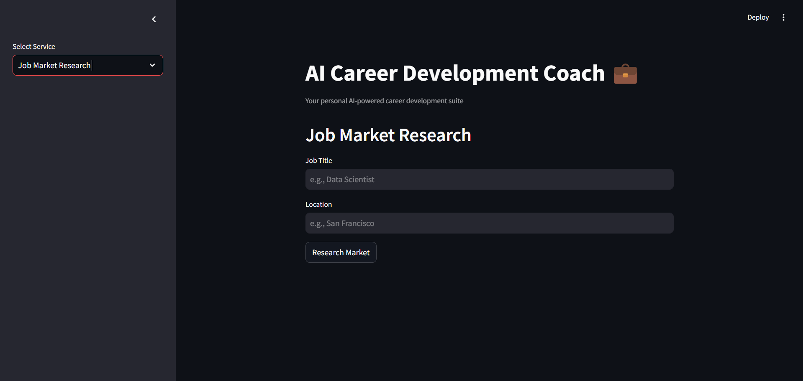
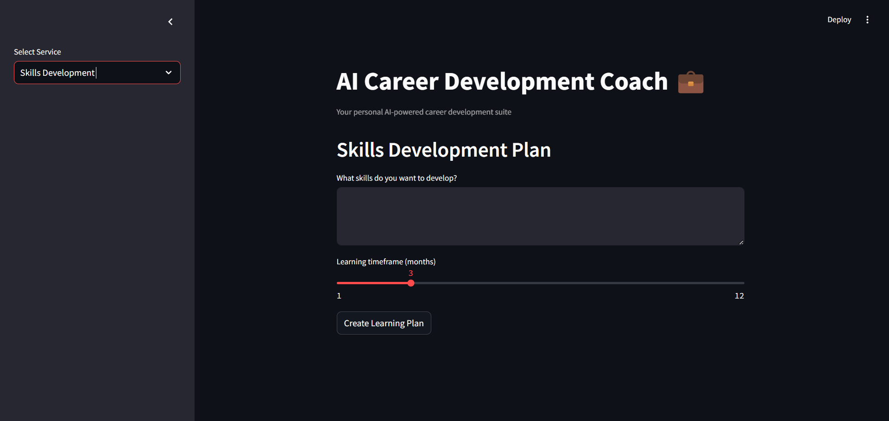
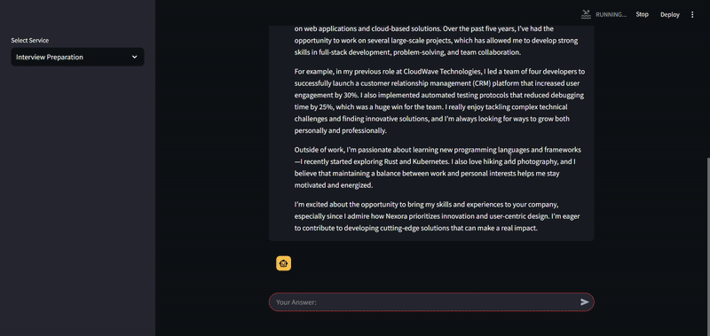
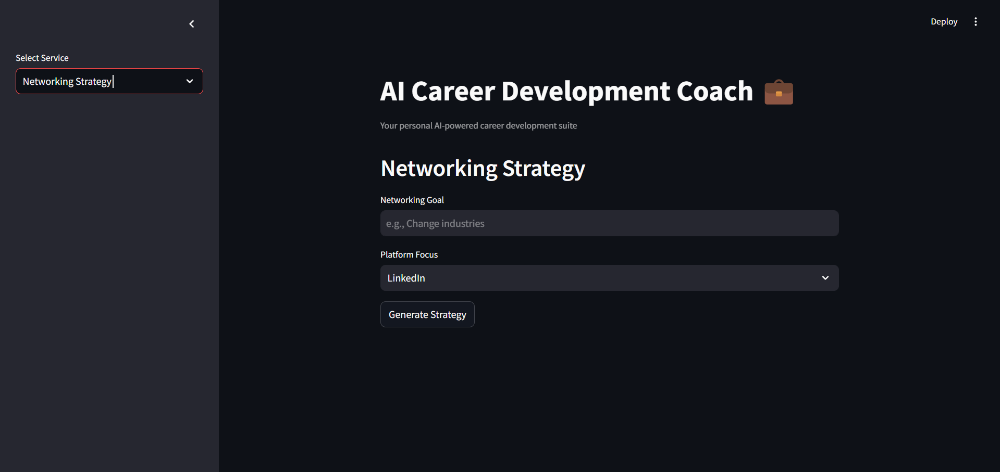
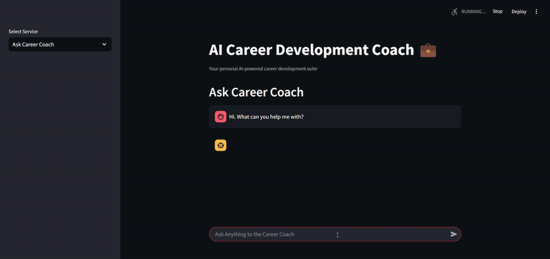

# Career Coach LLM App

## Overview

This **Career Coach LLM App* is designed to provide personalized career guidance using large language models. This project consists of several modules:

- **app**: Contains the main application code
- **career_coach_llm**: Included the core logic for the career coaching LLM.
- **experiments**: Houses various experiments and research related to improving the LLM's performance.

The Career Coach LLM App consists of many sections, each responsible for a specific aspect of the application. These sections include:

- **Dashboard**: Allows users to input their profile details (e.g., industry, experience, current role, target role) and generates a weekly action plan tailored to their career goals.
- 
- **Resume Analysis**: Allows users to paste their resume text and optionally a job description for analysis. The app evaluates the resume and provides feedback on how well it matches the job description.
- 
- **Job Market Research**: Allows users to research the job market for a specific role and location. It provides insights into salary ranges, required skills, and market demand.
- 
- **Skills Development**: Helps users create a learning plan for developing specific skills within a given timeframe.
- 
- **Interview Preparation**: Simulates a mock interview session for a specific position and question type. It provides feedback on user responses.
- 
- **Networking Strategy**: Helps users generate a networking strategy based on their goals and preferred platform.
- 
- **Ask Career Coach**: Allows users to ask open-ended questions to the AI Career Coach. The app provides real-time responses in a chat-based interface.    
- 

## Table of Contents

- [Overview](#overview)
- [Installation](#installation)
- [Usage](#usage)

## Installation

To get started with the Career Coach LLM App. follow these steps:

### Prerequisites

Ensure you have the following installed on your system:

- Python 3.10 or higher
- Git
- Ollama
  
### Setup

1. Install Ollama and pull the model:

Download Ollama from https://ollama.com/

Install the `llama3.2` model by running the following command:

```bash
ollama pull llama3.2
ollama serve
```

2. Clone the repository:

```bash
git clone https://github.com/rahumanaslam/CareerCoachLLMApp.git
cd career-coach-llm
```

3. Install the required dependencies:

```bash
pip install -r requirements.txt
```

## Usage

### Running the Application

To run the application, execute the following command:

```bash
streamlit run app.py
```

This will start the Streamlit application, allowing you to interact with the different modules and features.
